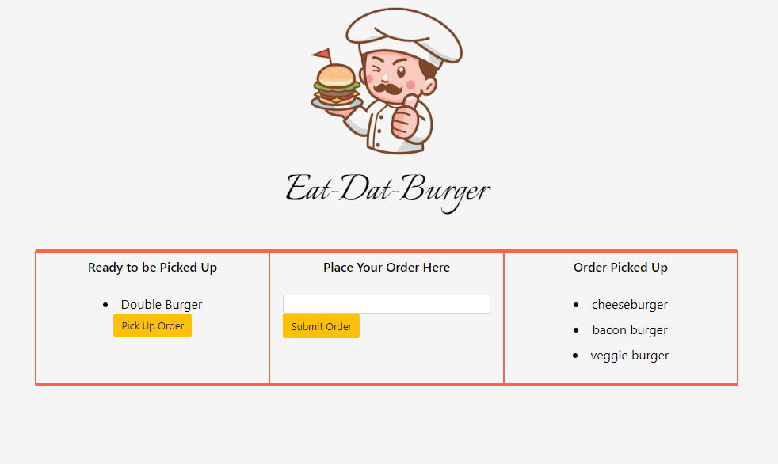

# Burger App

Eat-Da-Burger is a Full Stack application that lets the user create and pick up their hamburger order! It's ran by Node, an Express backend server and MySQL. This is my first Full Stack Engineering application!  

You type in the burger that you would like to order by pressing the submit order button. Once the burger is created, the order will show to the left side of the screen and will be ready to be picked up. Once picked up, the burger will show up on the right side showing all the order picked up from the database. 

Check out the application by clicking <a href="https://vast-wave-41861.herokuapp.com/">here!</a

# Technologies Used

<li>Node</li>
<li>Express</li>
<li>MySQL</li>
<li>MVC Pattern</li>
<li>Javascript</li>
<li>Bootstrap</li>
<li>jQuery</li>
<li>Handlebars</li>

